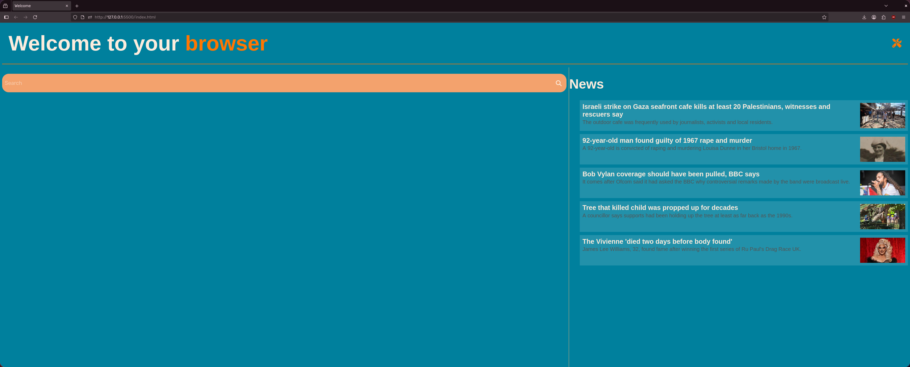

# YAWP - YetAnotherWelcomePage

Welcome to **YAWP** – a customizable welcome page with theme switching, built-in search engine selection, and real-time RSS news integration.

 <!-- Optional: add a screenshot here -->

## ✨ Features

- 🎨 Switch between 3 stylish themes
- 🔍 Quick search with Google, Bing, or DuckDuckGo
- 📰 Real-time RSS news feed
- ⚙️ Simple and clean settings panel

## 🚀 Getting Started

1. Clone the repository:
   ```bash
   git clone https://github.com/your-username/yawp.git
   cd yawp
   ```

2. Open `index.html` in your browser:

   - macOS:
     ```bash
     open index.html
     ```
   - Linux:
     ```bash
     xdg-open index.html
     ```
   - Windows:
     ```bash
     start index.html
     ```

## 💡 Why YAWP?

YAWP was created to be a clean, practical, and visually appealing homepage replacement – fully static and ready to use out of the box.

## 🙌 Credit Me

If you use this project in a larger one, redistribute or fork it publicly, **please give proper credit**:

```markdown
Based on [YAWP](https://github.com/AlbaOnTop/yawp) by [AlbaOnTop](https://github.com/AlbaOnTop)
```

A simple link in the description, documentation, or page footer is enough. It means a lot!
